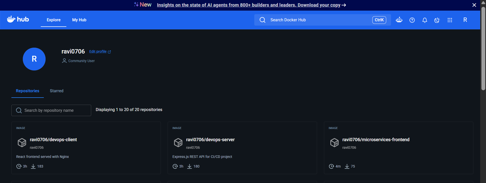
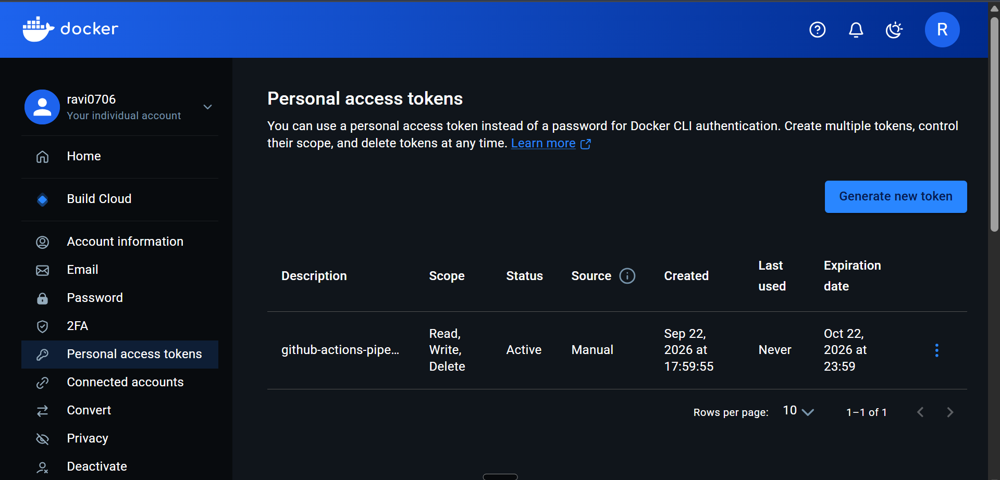

# 🚢 Step 4: Docker Hub Registry & Access Token Setup

Welcome to Day 4! ⚓ Today we set up **Docker Hub**, our cloud registry where our built Docker images will be stored, tagged, and delivered to AWS EC2. ☁️

---

## 🏬 What is a Container Registry?

Think of Docker Hub as a **central warehouse** for shipping containers:

```
[GitHub Actions Runner]                     [AWS EC2 Instance]
   Builds Docker Image                        Pulls Docker Image
            │                                         ▲
            ▼                                         │
    📦 docker push                             📥 docker pull
            │                                         │
            └──────────► [🚢 DOCKER HUB] ─────────────┘
                     (Cloud Image Warehouse)
```

1. **GitHub Actions** builds the image and pushes it to Docker Hub.
2. **AWS EC2** connects to Docker Hub and downloads the image to run it.

---

## 📋 Step-by-Step Instructions

### Step 1: Create a Free Docker Hub Account 👤

1. Open your browser and go to [https://hub.docker.com/](https://hub.docker.com/).
2. Click **Sign Up** (it's 100% free).
3. Choose your username (for example: `alexdevops`).
4. 📝 Write down your username—you will need it soon!

---

### Step 2: Create Two Repositories 📦

You need two separate repositories: one for the Backend, one for the Frontend.

#### 🟢 Repository 1: The Backend API

1. In the top navigation bar, click **Repositories**.
2. Click the blue **Create repository** button.
3. Fill in:
   - **Repository Name**: `devops-server`
   - **Description**: `Express.js REST API for CI/CD project`
   - **Visibility**: Select **Public** 🌐 _(Public allows EC2 to pull images without extra configuration)_.
4. Click **Create**.

#### ⚛️ Repository 2: The Frontend UI

1. Click **Create repository** again.
2. Fill in:
   - **Repository Name**: `devops-client`
   - **Description**: `React frontend served with Nginx`
   - **Visibility**: Select **Public** 🌐.
3. Click **Create**.

🎉 You now have two repositories ready:

- `<YOUR_USERNAME>/devops-server`
- `<YOUR_USERNAME>/devops-client`

---

### Step 3: Generate a Personal Access Token (PAT) 🔑

> [!CAUTION]
> **Never use your actual Docker Hub login password in automation scripts!**  
> If your password is leaked, someone could take over your account. Instead, companies use **Personal Access Tokens (PAT)**. A PAT is a generated secret key that can only push/pull images and can be revoked with a single click if needed.

Here is how to create one:

1. Click on your **profile icon** in the upper-right corner of Docker Hub.
2. Select **Account Settings**.
3. In the left menu, click on **Security** 🛡️.
4. Click the blue **New Access Token** button.
5. In the modal:
   - **Access Token Description**: `github-actions-pipeline`
   - **Access Permissions**: Leave it on **Read, Write, Delete** ✍️.
6. Click **Generate**.
7. 📋 **IMPORTANT**: Docker Hub will show you a long string starting with `dckr_pat_...`.
   - Click the **Copy** button.
   - Save it in a temporary text file on your computer. You will paste this into GitHub Secrets in Step 6 as `DOCKER_PASSWORD`!

---

## 📸 Proof of Work: Screenshots

> [!TIP]
> **Capture your proof of work!** Save your screenshots into `docs/screenshots/` and link them here:

### 🖼️ Screenshot 1: Docker Hub Repositories Created



### 🖼️ Screenshot 2: Personal Access Token (PAT) Generated



---

## 🎯 What You Have Accomplished

- [x] Created Docker Hub account.
- [x] Created `devops-server` image repository.
- [x] Created `devops-client` image repository.
- [x] Generated and securely saved your Personal Access Token (PAT).

---

## ⏭️ Ready for Day 5?

Now let's fire up our cloud virtual machine on Amazon Web Services:  
👉 **[Go to Step 5: 05-aws-ec2-setup.md](./05-aws-ec2-setup.md)**
